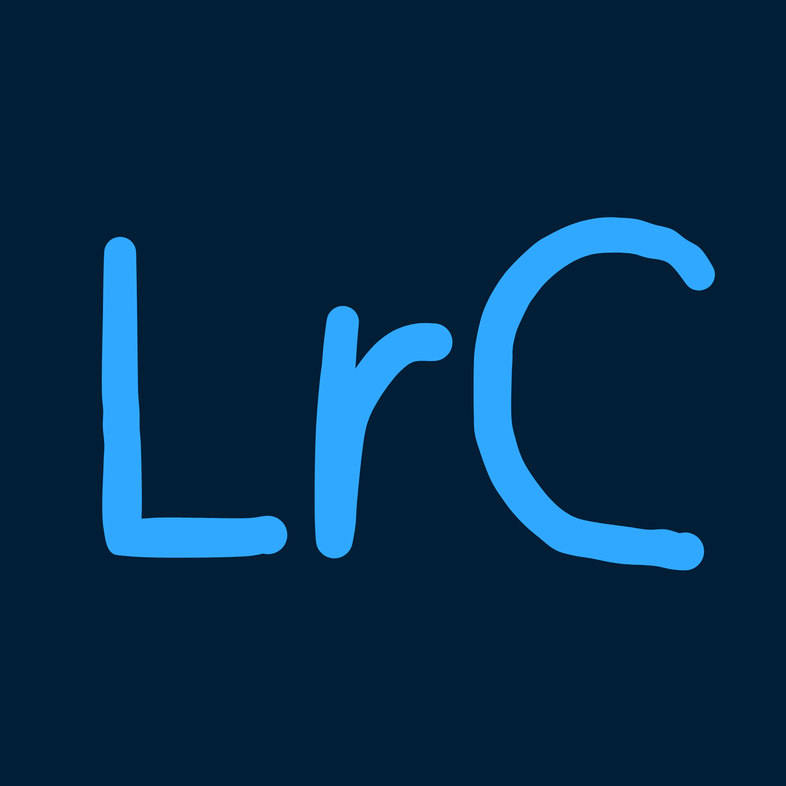

# MyLightroom

Desktop RAW photo editor inspired by **Adobe Lightroom Classic**, built with **Qt 6** and **C++20**. Edits are non-destructive; develop settings live in sidecar JSON next to each file. A local **AI Match** engine transfers a reference look across a batch using histogram fingerprinting and CPU heuristics (no cloud, no GPU required).



---

## Table of contents

- [Overview](#overview)
- [Modules & UI](#modules--ui)
- [Develop engine (color pipeline)](#develop-engine-color-pipeline)
- [AI Match (3-stage)](#ai-match-3-stage)
- [Presets, XMP & LUT](#presets-xmp--lut)
- [Catalog & caching](#catalog--caching)
- [Supported formats](#supported-formats)
- [Project structure](#project-structure)
- [Requirements](#requirements)
- [Build (Windows + vcpkg)](#build-windows--vcpkg)
- [Run & deploy](#run--deploy)
- [Sidecar format](#sidecar-format)
- [Keyboard shortcuts](#keyboard-shortcuts)
- [Workflows](#workflows)
- [Limitations vs Lightroom Classic](#limitations-vs-lightroom-classic)
- [License & credits](#license--credits)

---

## Overview

MyLightroom targets photographers who want a **Lightroom-like Library + Develop workflow** on Windows, with optional **batch look matching** when shooting the same scene under different exposures or cameras.

| Area | Technology |
|------|------------|
| UI | Qt 6 Widgets, dark Lightroom-style theme |
| RAW decode | LibRaw (16-bit linear, as-shot camera WB) |
| Develop | Custom float pipeline (`DevelopPipeline`) |
| Catalog | SQLite (`Catalog`) |
| AI Match | Classical CDF + heuristic regressor + coordinate descent (CPU) |
| Build | CMake 3.24+, vcpkg (`qtbase`, `libraw`) |

Numbers in the UI use **Arabic numerals** (`QLocale::c()`).

---

## Modules & UI

### Top module bar

| Module | Purpose |
|--------|---------|
| **Library** | Grid of thumbnails, folders tree, ratings, pick/reject |
| **Develop** | Full-screen canvas, left navigator/presets/history, right develop panels |
| **AI** | Reference vs active compare, match controls, auto-tone helpers |
| **Export** | Opens export dialog (also under **File → Export Current/Batch**) |

Module shortcuts: **`G`** Library, **`D`** Develop.

### Layout (Lightroom parity)

```
┌─────────────────────────────────────────────────────────────┐
│  Module bar: Library | Develop | AI | Export                │
├──────────┬────────────────────────────────────┬─────────────┤
│ Left     │         Center canvas              │ Right       │
│ 240 px   │   (Library grid or Develop view)   │ 320 px      │
│          │                                    │             │
│ Navigator│                                    │ Histogram   │
│ Folders  │                                    │ Basic, HSL… │
│ Presets  │                                    │             │
│ History  │                                    │             │
├──────────┴────────────────────────────────────┴─────────────┤
│  ‹  Filmstrip (thumbnails + paging)  ›                      │
└─────────────────────────────────────────────────────────────┘
```

- **Left panel:** fixed **240 px** — Navigator, Folders, Presets tree, Snapshots, History.
- **Right panel:** fixed **320 px** — Histogram (with clipping indicators), collapsible develop panels.
- **Filmstrip:** letterboxed thumbnails, **`‹` / `›`** paging (5 thumbs per click), scroll-into-view on selection, **REF** badge on reference photo.

### Interaction rules

| Action | Behavior |
|--------|----------|
| Double-click slider **label** | Reset that control to default (0 / neutral) |
| Click develop **canvas** | Toggle zoom **Fit** ↔ **1:1** (anchor at click point) |
| Drag on **histogram** | Adjust Blacks / Exposure / Whites zones (live preview, commit on release) |
| **Reference Photo** | Separate buffer from active image; badge in filmstrip & library grid |
| Before/After | **`\\`** (backslash) toggles before/after on canvas |
| Crop | **`R`** toggles crop overlay (Develop only) |

Develop sliders show **colored gradient grooves** (Temp, Tint, Vibrance, Saturation, HSL, Calibration) with **editable numeric fields** (`DevelopValueSpin`) beside each bar. Temp defaults to **6500 K** at center.

---

## Develop engine (color pipeline)

All pixel work runs in a **16-bit linear float workspace** (`Format_RGBX64` → float). Output is encoded to **8-bit sRGB** only at the end, which preserves highlight headroom and avoids the flat/washed look of an 8-bit gamma chain.

### RAW decode (`RawDecoder`)

- LibRaw: **16-bit**, **linear gamma** (`gamm = 1`), **`no_auto_bright`**, **as-shot camera WB** (`use_camera_wb`).
- Scene-referred linear stored in `RawImage.linearRgb`.
- An 8-bit display **`preview`** (WB + sRGB) is kept for AI features and quick thumbnails.
- Embedded thumbnails apply **LibRaw EXIF flip** for correct orientation in Library/filmstrip.

### Strict processing order

1. **Geometry** — crop, rotate, straighten  
2. **Lens corrections** — manual distortion, chromatic aberration (sliders in `LensSettings`; no auto lens DB yet)  
3. **White balance** — as-shot neutral baseline; **Temp / Tint** are relative offsets (6500 K / 0 = no change)  
4. **Exposure & contrast** — linear gain (exposure in stops); contrast in display domain after base curve  
5. **Tone mapping (PV2012-style)** — region masks for Highlights, Shadows, Whites, Blacks  
6. **Presence** — Texture, Clarity, Dehaze (unsharp/box-blur in linear)  
7. **Adobe Color base curve** — emulated medium-contrast S-curve + parametric/point tone curve  
8. **HSL** — 8 hue bands  
9. **Color Grading** — 3-way wheels (balance / blending)  
10. **Camera Calibration** — shadow tint, RGB primaries  
11. **3D LUT** — `.cube` / `.3dl` with intensity  
12. **Vibrance / Saturation** — skin-tone–protected vibrance  
13. **Effects & detail** — vignette, grain, sharpen, noise reduction  
14. **Encode** — linear → sRGB; histogram computed on final 8-bit image  

Entry point: `DevelopPipeline::renderLinear(linear64, settings, wbCoeffs, maxEdge)`.

### Live editing performance

- **Interactive preview:** downscaled linear source (~1024 px) while dragging sliders.  
- **Throttling:** leading-edge timer so drags stay responsive (~40 fps target).  
- **`setSettingsLive`:** updates preview without history spam; **commit on slider release**.  
- **Full render:** async on thread pool; multithreaded scanline bands + precomputed 1D curve LUT.  
- Histogram / navigator updates deferred during interactive drags.

---

## AI Match (3-stage)

Runs **only when invoked** (not on import). Scene classification is lazy until AI module or match is used.

| Stage | Role |
|-------|------|
| **1 — Classical matcher** | Lab stats, luminance CDF, zone distribution; **Wasserstein-1** distance → baseline Exposure, Contrast, Temp, Tint, tone split |
| **2 — Heuristic regressor** | **520-dim** input → **~32** develop deltas; ONNX optional (`models/parameter_regressor.onnx`), CPU heuristic fallback |
| **3 — Refinement** | Up to **15** coordinate-descent iterations on **512 px** preview; minimizes fingerprint loss vs reference |

Batch **Apply Match to All** runs on `QThreadPool`, streams thumbnails back to the UI, writes sidecar + SQLite catalog.

Related helpers: **Auto Tone**, **Auto Exposure**, **Auto White Balance**, **Match Total Exposures** (align mean lightness to reference).

---

## Presets, XMP & LUT

### Built-in & custom presets

- JSON presets in [`presets/`](presets/) (loaded by `PresetManager`).
- **Import XMP** (Lightroom/Camera Raw): Basic (2012), tone curve, HSL, color grading, calibration, effects, detail. See `XmpParser`.
- Embedded Adobe LookTable/RGBTable is **not** converted — use companion **`.cube` / `.3dl`** when present.

### LUT

- Import via preset bundle or manual path.
- Intensity slider; applied in the develop pipeline after calibration.

---

## Catalog & caching

| Layer | Implementation |
|-------|----------------|
| **SSD thumbnail cache** | `ThumbnailCache` — MD5 key (`v3\|path\|size\|mtime`), JPEG on disk under app cache |
| **RAM decoded-image cache** | `ImageCache` — LRU of `RawImage` (count + byte budget, default ~4 GB cap) |
| **Catalog DB** | SQLite — folders, metadata, ratings, collections, match profiles |

Sidecar path pattern: `{filename}.cr2.mylr` (JSON) next to each RAW.

---

## Supported formats

**RAW (LibRaw):** `.cr2`, `.cr3`, `.nef`, `.arw`, `.dng`, `.raf`, `.orf`, `.rw2`

**Export:** JPEG, PNG, TIFF (via `ExportEngine`); optional watermark, batch naming template `{name}`, `{seq}`.

---

## Project structure

```
MyLightroom/
├── src/
│   ├── app/           MainWindow, DocumentController
│   ├── ui/            DevelopPanel, Filmstrip, Library grid, Histogram, Viewport…
│   ├── raw/           RawDecoder (LibRaw)
│   ├── render/        DevelopPipeline, StraightenDetector
│   ├── core/          DevelopSettings, EditGraph, SidecarIO, XmpParser, caches
│   ├── ai/            MatchEngine, ClassicalMatcher, FeatureExtractor, AutoAdjust
│   ├── catalog/       SQLite catalog
│   ├── export/        ExportEngine
│   ├── lut/           LutEngine, LutImporter
│   └── color/         ColorManager
├── presets/           JSON presets + sample LUTs
├── models/            Optional ONNX regressor (see models/README.md)
├── resources/         app.qrc, LrC.png icon
├── tools/vcpkg/       Bundled vcpkg (optional local toolchain)
├── CMakeLists.txt
└── vcpkg.json
```

---

## Requirements

- **OS:** Windows 10/11 (primary target)
- **Compiler:** MSVC 2022+ or compatible (C++20)
- **CMake:** 3.24+
- **Qt:** 6.7+ — Core, Gui, Widgets, OpenGLWidgets, Sql, Concurrent
- **Libraries:** LibRaw, SQLite (via Qt SQL), nlohmann-json (via core)
- **Optional:** ONNX Runtime (`MYLR_USE_ONNX=ON`) for ML Stage 2

---

## Build (Windows + vcpkg)

This repo may include vcpkg under `tools/vcpkg`. First configure can take **30–90 minutes** (Qt + LibRaw).

### Visual Studio 2022

```powershell
cd "d:\Project\!MyLightroom"

cmake -B build -S . `
  -DCMAKE_TOOLCHAIN_FILE="d:/Project/!MyLightroom/tools/vcpkg/scripts/buildsystems/vcpkg.cmake" `
  -G "Visual Studio 17 2022" -A x64 `
  -DMYLR_BUILD_TESTS=OFF `
  -DMYLR_USE_ONNX=OFF

cmake --build build --config Release
```

### Visual Studio 2026

Replace the generator with `"Visual Studio 18 2026"`.

### Optional ONNX (CUDA)

```powershell
# Install via vcpkg first, then:
cmake -B build -S . -DMYLR_USE_ONNX=ON ...
```

Post-build steps (CMake) automatically copy **Qt plugins** (`platforms`, `imageformats`, `sqldrivers`, …) and **vcpkg runtime DLLs** (jpeg, sqlite, LibRaw, etc.) next to the executable.

---

## Run & deploy

```powershell
.\build\src\Release\MyLightroom.exe
```

If you see **“Qt platform plugin could not be initialized”**, rebuild Release so post-build deploy runs, or run from the directory that contains `platforms\` and all DLLs.

**First use**

1. **File → Import Folder…** — select a folder of RAW files.  
2. Or **File → Open RAW…** — single file.  
3. Switch modules with the top bar or **`G` / `D`**.

A desktop shortcut can point to `MyLightroom.exe` with working directory set to `build\src\Release\`.

---

## Sidecar format

Edits persist as JSON sidecars:

```
IMG_0489.CR2
IMG_0489.CR2.mylr    ← develop settings + optional AI match profile
```

`SidecarIO` serializes `DevelopSettings` and `MatchProfile` (reference fingerprint, scene context). Loading an image merges sidecar state into `EditGraph` history.

---

## Keyboard shortcuts

| Key | Action |
|-----|--------|
| `G` | Library module |
| `D` | Develop module |
| `R` | Toggle crop (Develop) |
| `\` | Toggle before/after |
| `Ctrl+Z` / `Ctrl+Y` | Undo / Redo |
| `Ctrl+Shift+C` / `V` | Copy / paste settings |
| `Ctrl+Alt+Shift+M` | Apply Match to All (AI menu) |

---

## Workflows

### Basic develop

1. Import folder → select image in filmstrip or Library grid.  
2. Adjust panels on the right; history records each committed change.  
3. **File → Save Sidecar** (also auto-saved on many operations).

### Preset from Lightroom XMP

1. **Presets → Import XMP…** (or place under `presets/`).  
2. Click preset in tree to apply.  
3. If colors still differ from Lightroom, see [Limitations](#limitations-vs-lightroom-classic) — tune Temp/Tint or add a `.cube` LUT from the same pack.

### AI Match batch

1. Edit reference photo in Develop.  
2. **Develop / AI → Set as Reference Photo** (or context menu in Library).  
3. Select targets → **Apply Match to Current** or **Apply Match to All**.  
4. Review confidence in AI module; sidecars updated per image.

### Export

- **Export** module button or **File → Export Current / Batch**.  
- Full-resolution render uses linear `RawImage` + `renderLinear` (not the downscaled interactive buffer).

---

## Limitations vs Lightroom Classic

MyLightroom aims for **visually close** results, not bit-identical parity:

- No Adobe **DCP / Camera Matching** profiles — **Adobe Color** is **emulated** via a base tone curve.  
- Absolute **Temp (Kelvin)** is approximate; as-shot WB comes from LibRaw/camera metadata.  
- Some XMP fields (embedded LookTable, profile name only) are skipped or warned.  
- No Map, Book, or Print modules; no cloud sync.  
- Lens correction is **manual** sliders only (no Lensfun database).

For best preset parity: use the same numeric sliders, prefer presets that ship a **`.cube` LUT`**, and compare after setting Temp/Tint to the same values as Lightroom.

---

## License & credits

- Application code: see repository license (if present).  
- **LibRaw**, **Qt**, **SQLite** — respective licenses.  
- UI inspiration: Adobe Lightroom Classic (trademarks belong to Adobe).

For ONNX model training/export, see [`models/README.md`](models/README.md).
